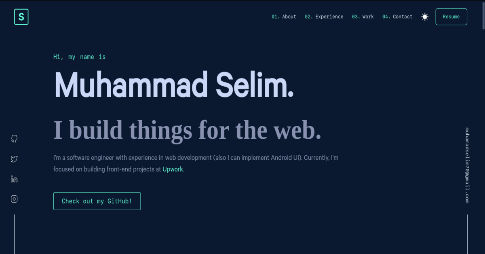

<h1 align="center">Muhammad Selim</h1>

  

    The first version of my personal website. the idea and the design were done by <a href="https://github.com/bchiang7/v4" target="_blank">Brittany Chiang</a>. I cloned the design and built it using HTML, CSS and pure JavaScript. and hosted with <a href="https://muhammadselim.pages.dev" target="_blank">Cloudflare</a>.

